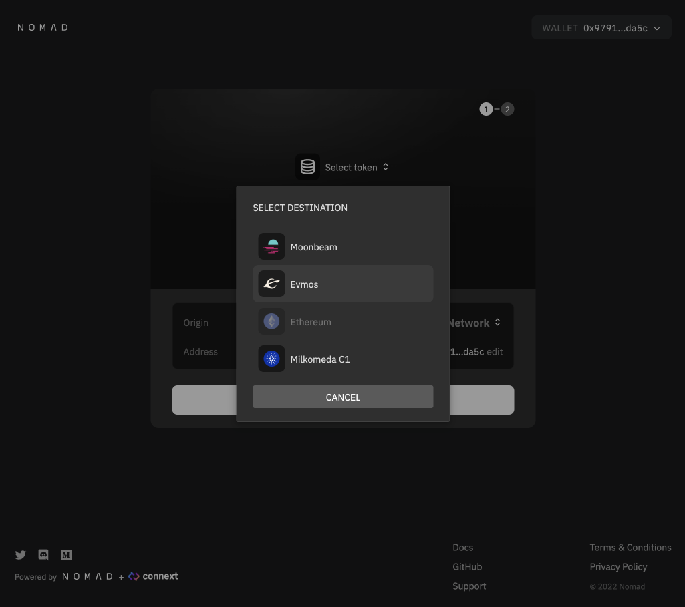
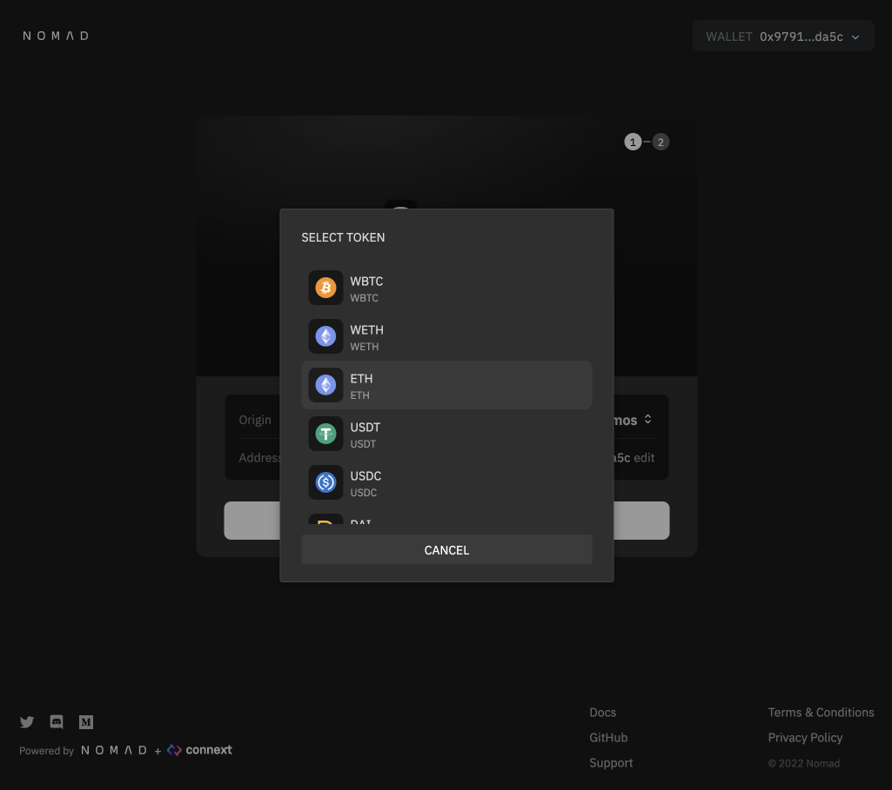
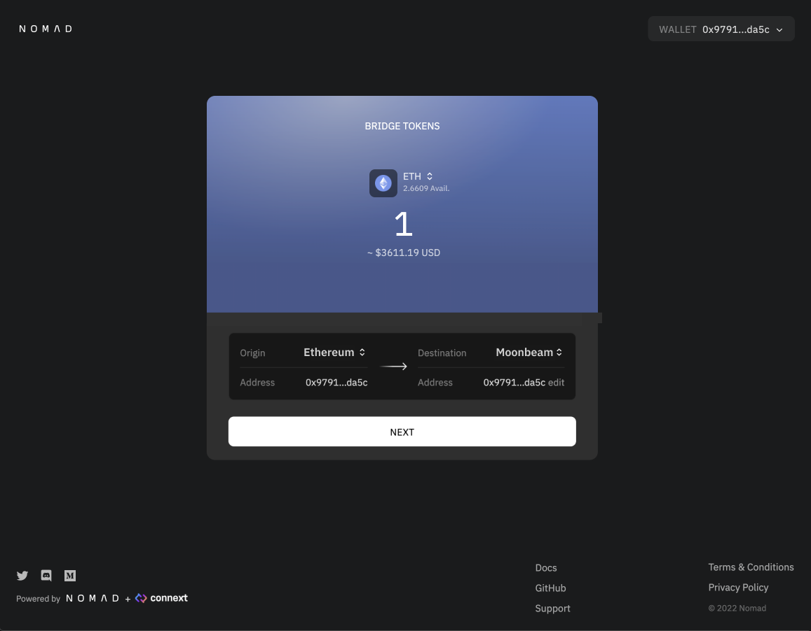
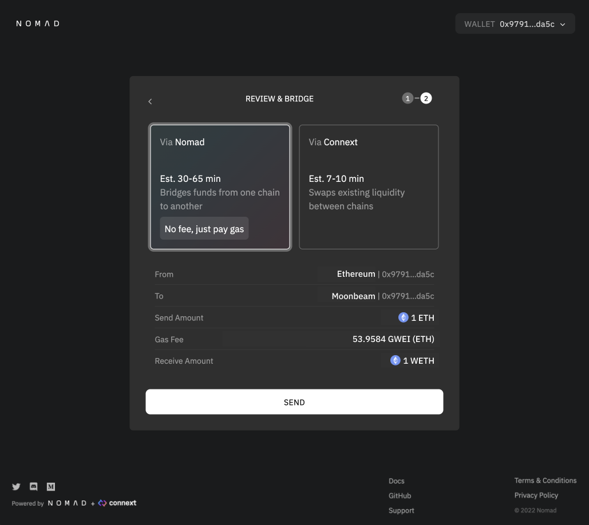
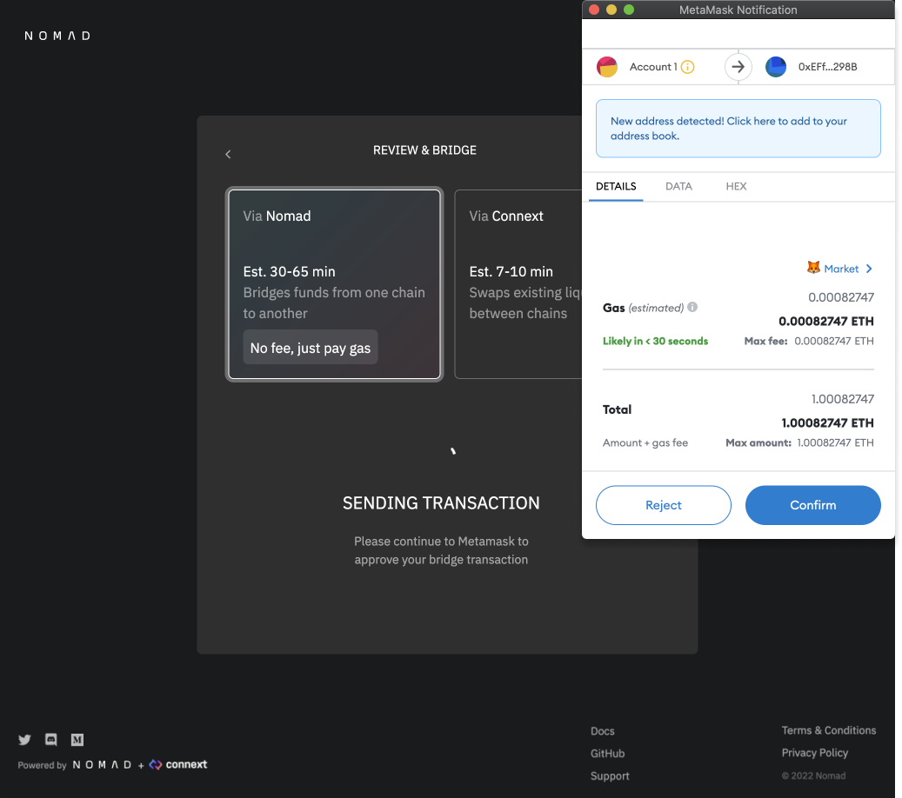
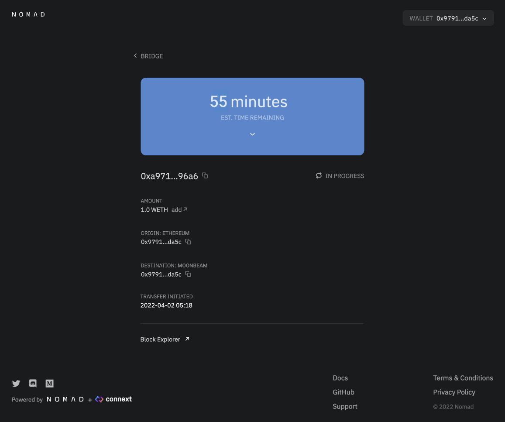
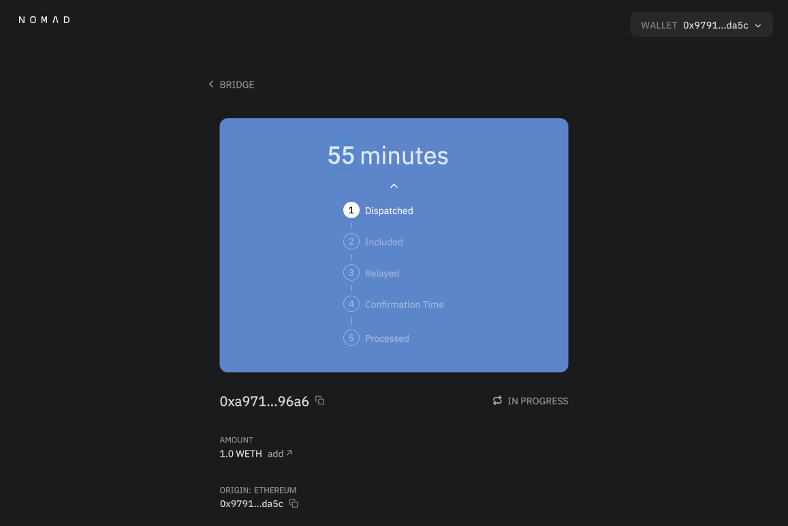
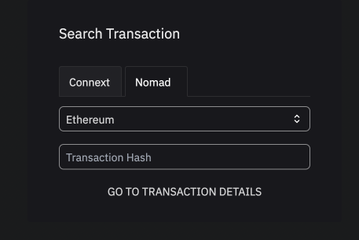
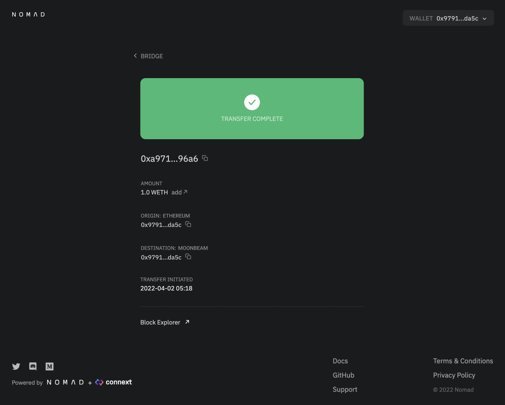
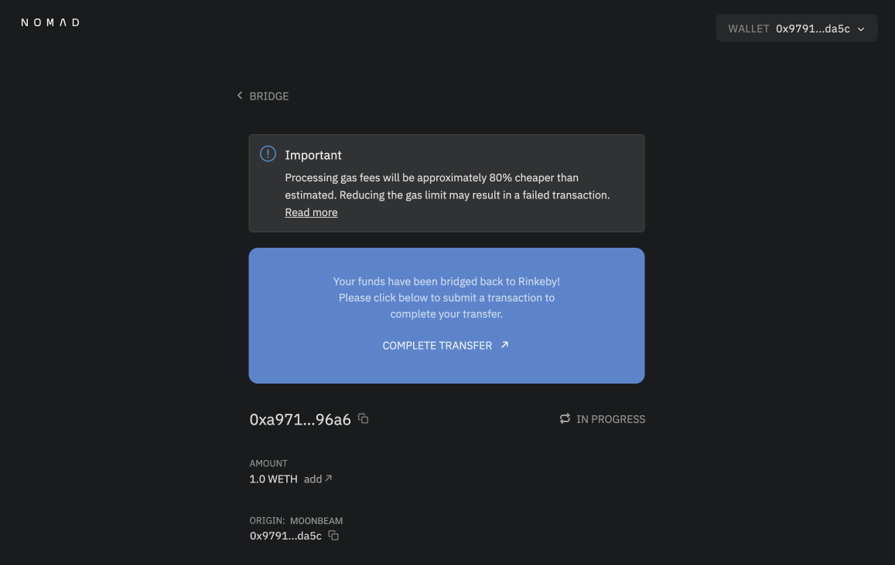

# Nomad Bridge GUI

## Nomad vs Connext, which should I use?

There are two options available to send funds through the GUI, Nomad and Connext. These are two distinct protocols that are complimentary to one another. We have partnered with Connext to provide an optimal experience for users!

Nomad is a secure gas efficient cross-chain protocol that allows users to bridge funds between networks. This takes, on average, 35-60 minutes. There are no fees associated with Nomad, just pay gas! Connext provides liquidity pools for Nomad assets, meaning users can receive funds on the destination chain much faster (less than 10 minutes) for an additional fee. Nomad is advised for large transfers.

Connext is not available for every asset and may not be available for larger sums. We recommend using Nomad if you intend to send large transfers.

## Bridging Through Nomad

Bridging assets across chains using Nomad should be intuitive and easy with the Nomad GUI. In this tutorial, we will walk through the steps required to bridge your assets.

Please find our production bridge GUI at [app.nomad.xyz](https://app.nomad.xyz/).

If you would like to test our bridge using testnet funds before using real funds, please visit our development GUI at [development.app.nomad.xyz](https://development.app.nomad.xyz/).

 

Connect to Metamask:

 

Select origin and destination networks:

 

(Optional) Change Destination address. This is set as your wallet address by default. Click "edit". A modal will pop up, click "change" inside the input. Then copy your address, click to paste, and save.
::: warning CAUTION
Sending assets to an address you do not control can result in a permanent loss of funds!
:::

 

Select the asset you want to send using the asset dropdown menu and the amount you want to send using the input prompt:

 

Click `Next`:

 

Review your transaction details and associated fees. Check if Connext liquidity is available for your transfer for a faster bridging experience! If proceeding with Connext, continue reading [here](#fast-transfers-with-connext).

 

Click `Bridge Tokens` and approve the transaction in Metamask:

 

After approving the transaction, you will be taken to the transaction details page. Here, you will see the estimated time remaining for your transfer to complete. Please save your transaction hash for convenience. If you lose it, you can visit your wallet address on the block explorer of the origin network and find the transaction again.

::: info
You must return to the Transaction Page after bridging has concluded to pay for gas and complete your transfer. Nomad may cover the processing and gas fees for some chains.
:::

 

You can expand the time estimate tab to track your transaction status by clicking the down arrow in the blue box:

 

(Optional) If you navigated away from the GUI at any point and want to find your transfer's progress page again, visit [https://app.nomad.xyz/tx](https://app.nomad.xyz/tx) and enter the origin network and your transfer's transaction hash.

 

Once your transfer has completed, you should see the below display and your funds will be in the account of your destination address. If your transfer is taking longer than expected, please reach out to us on [Discord](https://discord.gg/RurtmJApqm) in the #support channel:

 

## Completing a Transfer (Ethereum Destination Only)

If you are sending to Ethereum, there is one additional processing step due to the high cost of processing transactions on Ethereum. You will see the following display and should click "Complete Transfer" and complete the Metamask transaction. After this, your funds should be at your destination on Ethereum!

 

## Fast Transfers with Connext

Fill out data for your transfer and click "Next." Select "Connext." If there is liquidity available for your transfer, it will calculate associated fees for your transaction. Note that Connext collects gas fees in the asset that is being sent.

If there is not liquidity available, you can continue by using Nomad.

Click `Send` and approve the transaction in Metamask!

In a few minutes, you will see your transfer appear in a table below. Click "Claim" to submit a transaction to receive your funds on the destination chain.

Click "View" to go to your transaction in the ConnextScan block explorer. Or you can visit `https://connextscan.io/tx/<yourtransactionhash>`.

