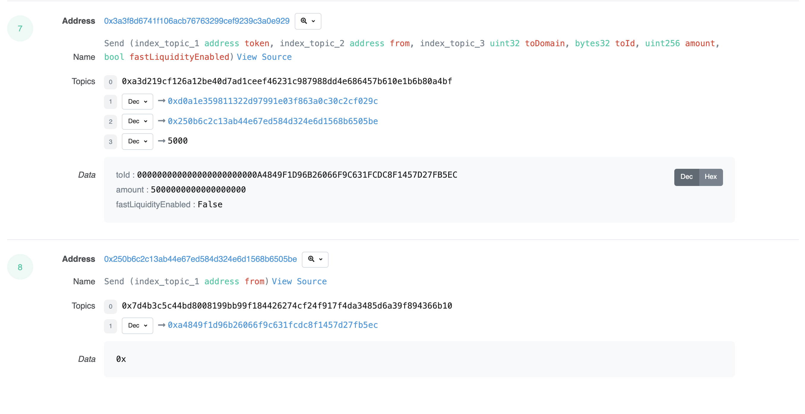

# Nomad Bridge GUI

Bridging assets across chains using Nomad should be intuitive and easy with the Nomad GUI. In this tutorial, we will walk through the steps required to bridge your assets.

Please find our bridge GUI at app.nomad.xyz.

Connect to Metamask:

Select origin and destination networks:

Select the asset you want to send and its amount:

Click `Bridge Tokens` and approve the transaction in Metamask:

After approving the transaction, you will be taken to the transaction details page. Here, you will see the estimated time remaining for your transfer to complete:

You can expand the time estimate tab to track your transaction status:

View details on Etherscan:

 

Coming soon with [Connext](https://nxtp-docs.connext.network/) integration
