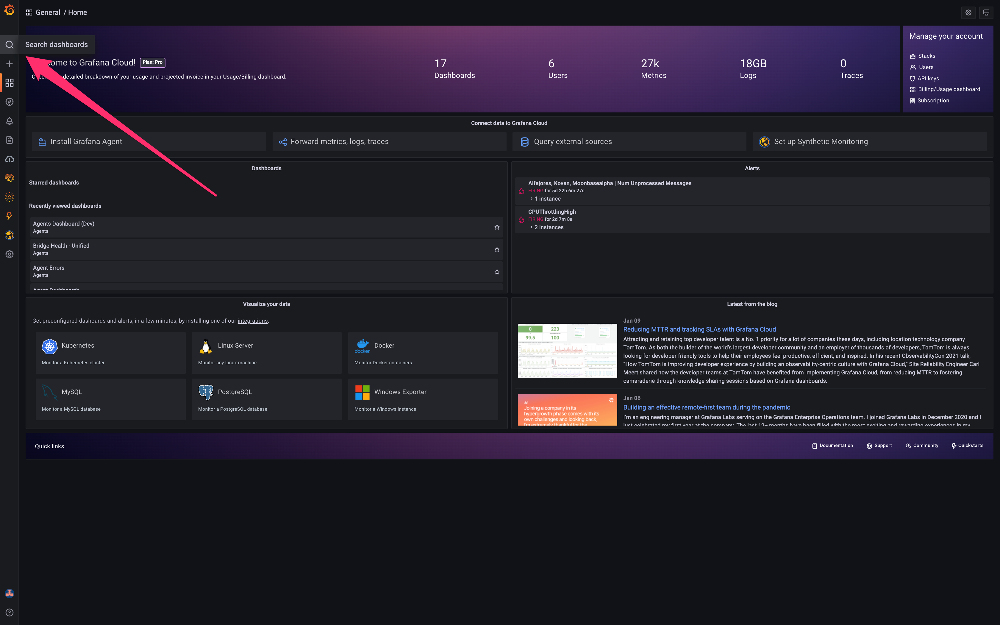
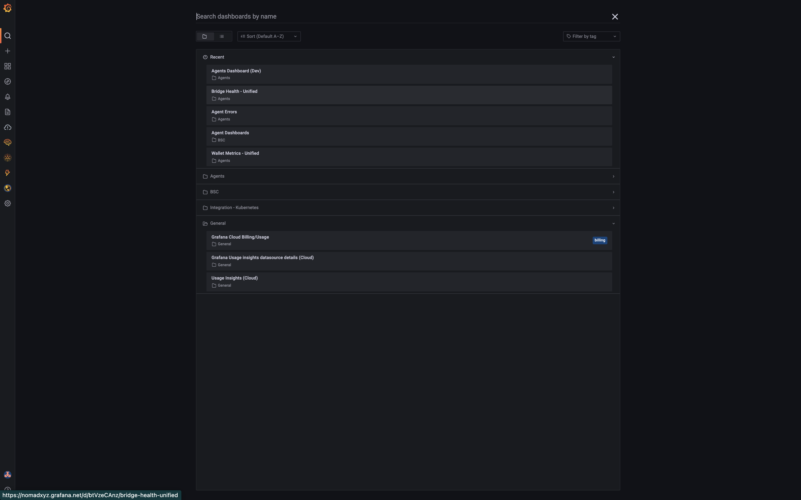
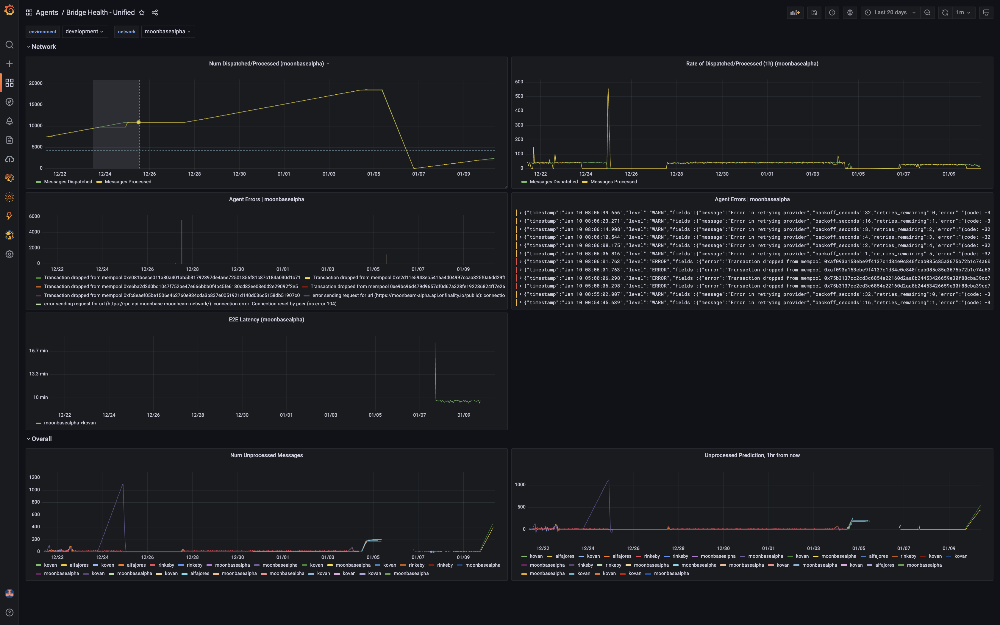
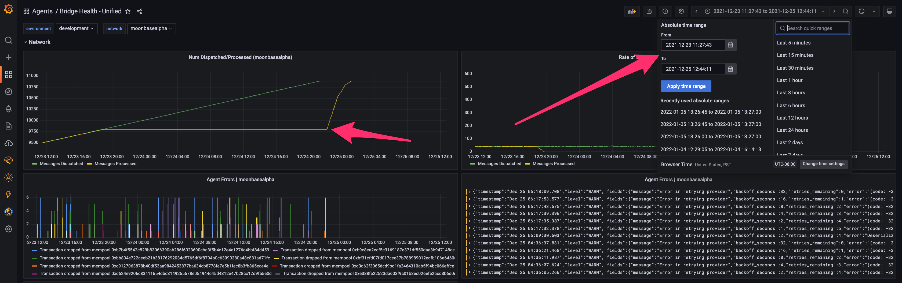
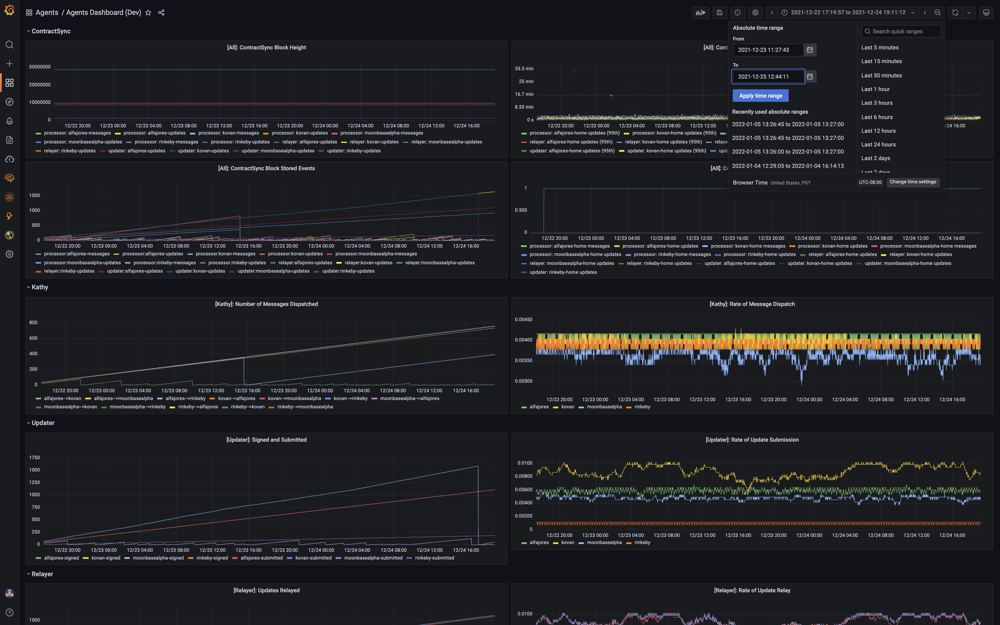
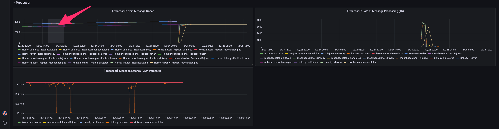
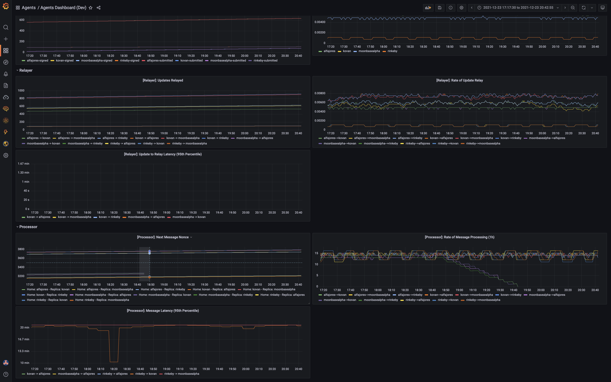
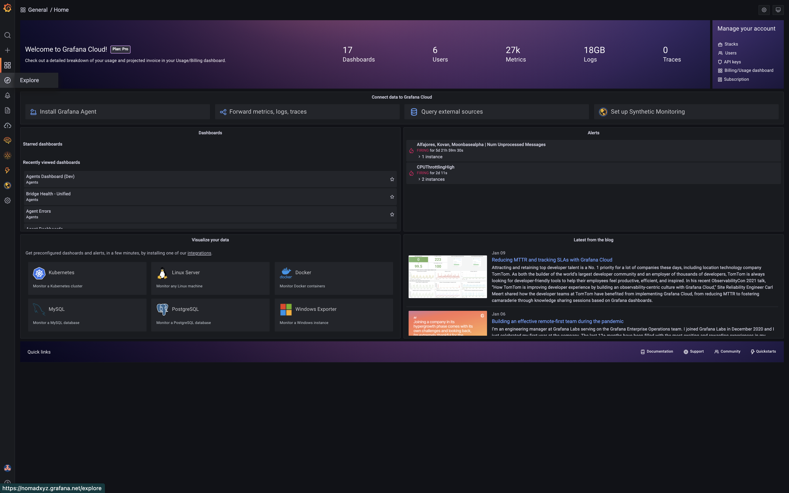
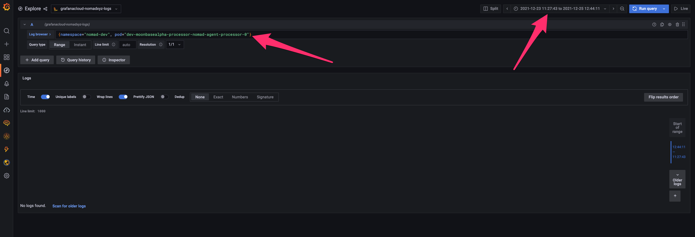
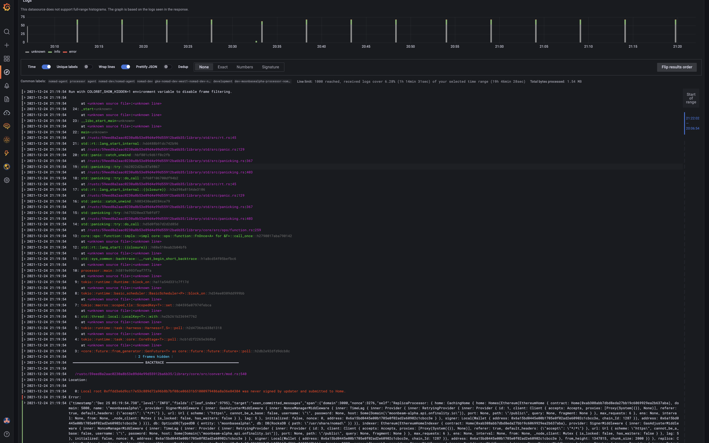

# Nomad Bridge GUI

As much as we'd like agents to run smoothly 24/7 without a hitch, in practice, this doesn't always happen. As we deploy to new networks, bugs in both our code and those of our RPC providers will surface over time. This tutorial examines a hypothetical example regression and to how to use Grafana dashboards and logs to debug the issue.

## Example Investigation

At a high level, these are the steps to debugging a regression:

1. Identify a regression and its time window.
2. Examine that time window in other dashboards for any immediate hints.
3. Query logs and reference the code to identify the root cause of the error or stall.

 

We will go through these steps in more detail below, starting with identifying a regression.

The most important birds-eye-view dashboard for initially spotting a regression is the `Bridge Health `dashboard. This dashboard tracks the number of outstanding, unprocessed messages and the number of processed messages. If our agents are keeping up with processing messages, these lines should always follow each other and should never diverge.

First navigate to the Bridge Health dashboard as shown below. On the main page, click on the `Search dashboards` tab on the far left.

 

Now find the Bridge Health dashboard among the listed dashboards.

 

Now that we have the `Bridge Health` dashboard in front of us, we spot a regression. In the highlighted region, we see that while the number of unprocessed messages continued increasing, the number of processed messages did not, meaning that there was a some kind of stall. This is almost always what regressions look like.

 

Highlight the regression to zoom in. We can already see a plethora of errors emitted during the stall in the error graph below the regression. More importantly, by highlighting the regression, we have identified the start and end timestamps for which the regression occurred (see top right corner).

 

Now that we know the general timestamp of the regression, we know where to look in other dashboards and in logs. Lets take a look at the `Agents` dashboard to see if we can find anything. This dashboard shows several agent-specific metrics and the activity rates of each agent. Navigate back to the Grafana home page and find the `Agents` dashboard in the same way we found the `Bridge Health` dashboard.

 

Once you have navigated to the `Agents` dashboard, copy-paste the regression timestamps into the timestamp window in the top right. This will narrow our examination window.

 

Once we've narrowed our time window, let's look at the processor `next_message_nonce` metric. This metric tracks what message a given processor is currently on for each channel. The `next_message_nonce` should be moving up and to the right if all is healthy. In the highlighted region, however, it looks it looks like the Moonbase processor metric stopped being reported.

 

Lets zoom in even more to see the discontinued reporting.

 

Now that we have a better idea of what our issue might be, let's check if our hypothesis about crash looping is correct using Grafana logs. Navigate back to the Grafana home page and find the `Explore` tab on the far left.

 

You should see a prompt at the top where you can write log queries. To query Grafana logs, we write Loki queries. For more details on writing Loki queries to narrow down your searches, see this [cheat sheet](https://grafana.com/docs/loki/latest/logql/log_queries/). Here, we just want a simple query that shows all logs during the time window for the Moonbase processor (see query in prompt).

 

If we look at our query results, we can see, the Moonbase processor is indeed crash looping with some error about a local root mismatch. This is when we would go back to the codebase and piece together the root cause of the error. The same applies for stalls that are not emitting explicit errors.

 

While we are not going to actually debug this regression, you get the idea. To reiterate, the general steps are to:

1. Identify a regression and its time window.
2. Examine that time window in other dashboards for any immediate hints.
3. Query logs and reference the code to identify the root cause of the error or stall.

 

In an ideal world, nobody has to go through these steps but errors and stalls are inevitable in the messy world of off-chain operations. With that said, happy debugging!
