---
title: Nomad Bridge GUI
lang: en-US
---

# Bridging To Milkomeda

## Using Nomad

Bridging assets from Ethereum to Milkomeda using Nomad should be intuitive and easy with the Nomad GUI. In this tutorial, we will walk through the steps required to bridge your assets.

Please find our production bridge GUI at [app.nomad.xyz](https://app.nomad.xyz/).

If you would like to test our bridge using testnet funds before using real funds, please visit our development GUI at [development.app.nomad.xyz](https://development.app.nomad.xyz/).

 

Connect to Metamask:

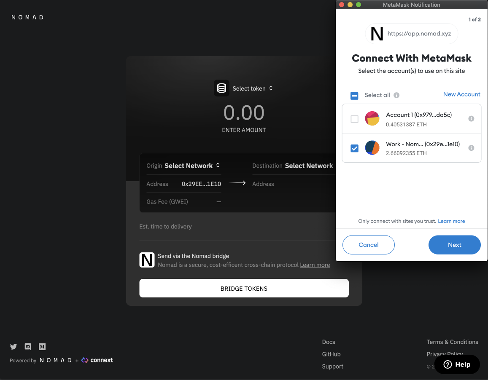

 

Select Ethereum as the origin network and Milkomeda C1 as the destination:

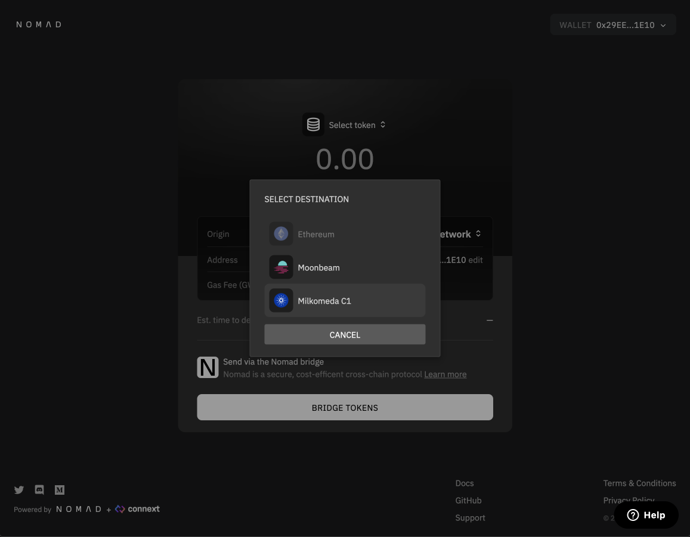
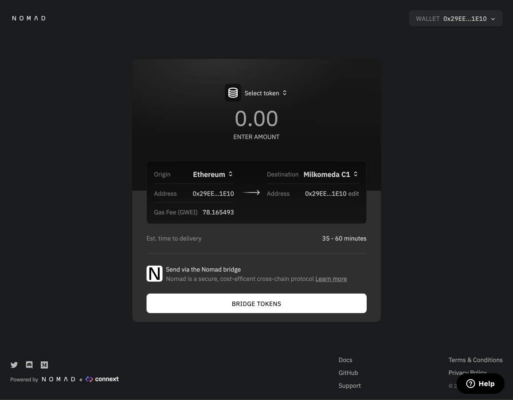

 

(Optional) Change Destination address. This is set as your wallet address by default. Click "edit". A modal will pop up, click "change" inside the input. Then copy your address, click to paste, and save.
::: warning CAUTION
Sending assets to an address you do not control can result in a permanent loss of funds!
:::

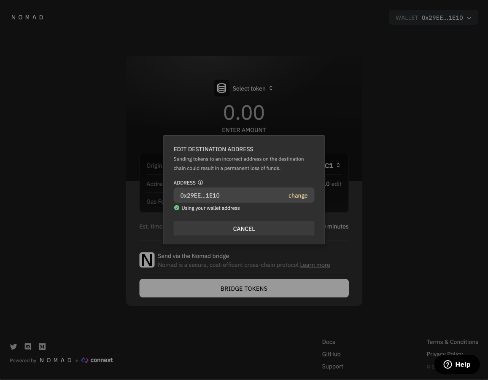
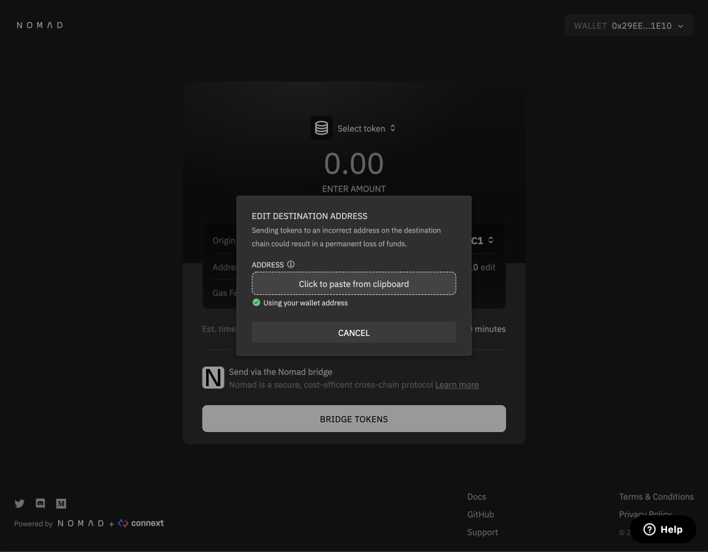

 

Select the asset you want to send using the asset dropdown menu and the amount you want to send using the input prompt:

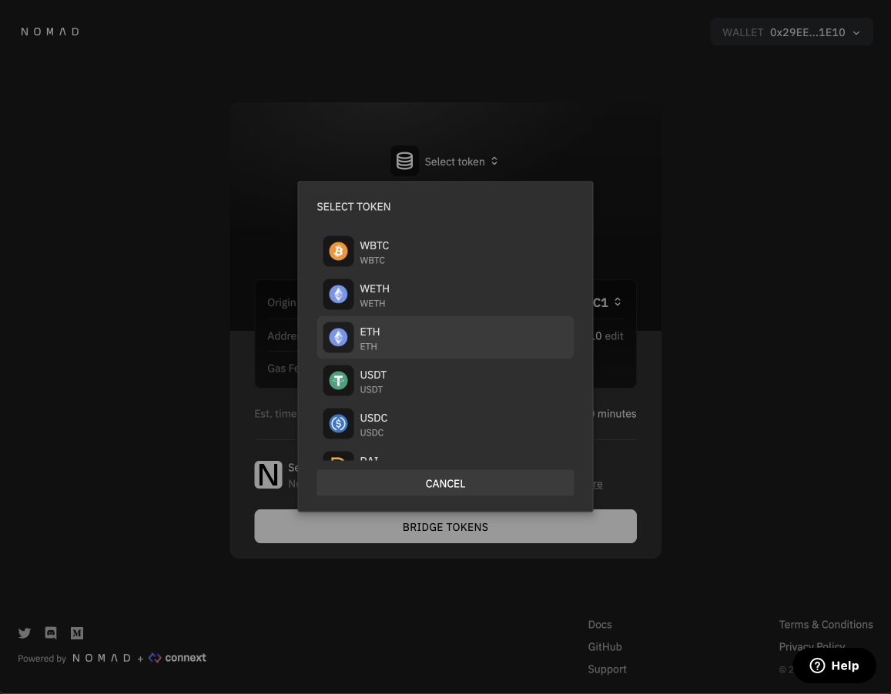
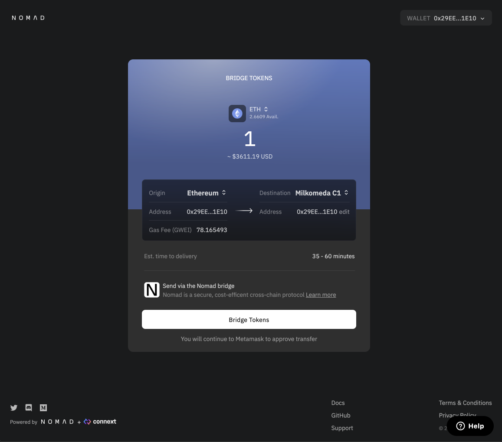

 

Click `Bridge Tokens` and approve the transaction in Metamask:

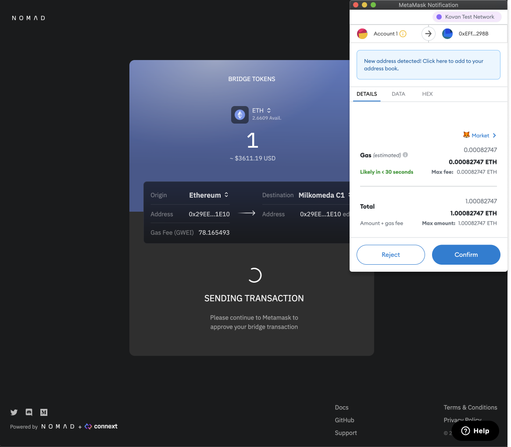

 

After approving the transaction, you will be taken to the transaction details page. Here, you will see the estimated time remaining for your transfer to complete. Please save your transaction hash for convenience. If you lose it, you can visit your wallet address on the block explorer of the origin network and find the transaction again.

::: info
Processing fees are subsidized for Milkomeda, so your funds will be deposited directly to your address without any further action!

If you bridge **back** to Ethereum, you will need to wait 30-65 minutes and then revisit the Transaction page to complete your transfer and receive your funds on Ethereum.
:::

 

You can expand the time estimate tab to track your transaction status by clicking the down arrow in the blue box:

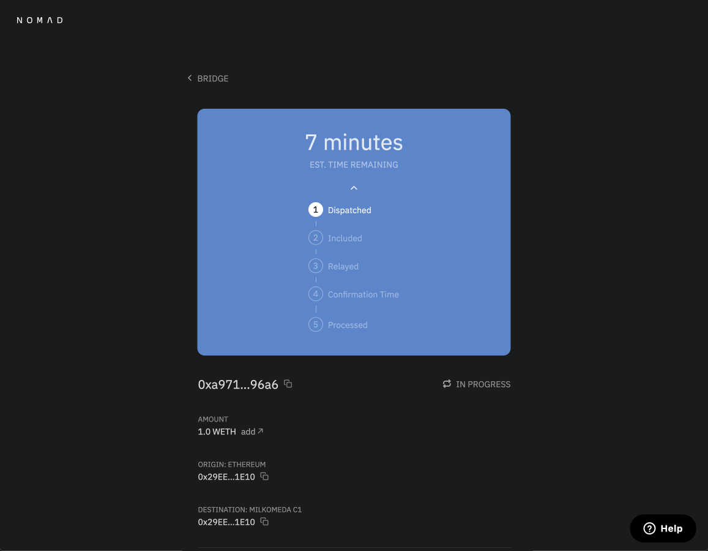

 

(Optional) If you navigated away from the GUI at any point and want to find your transfer's progress page again, visit [https://app.nomad.xyz/tx](https://app.nomad.xyz/tx) and enter the origin network and your transfer's transaction hash.

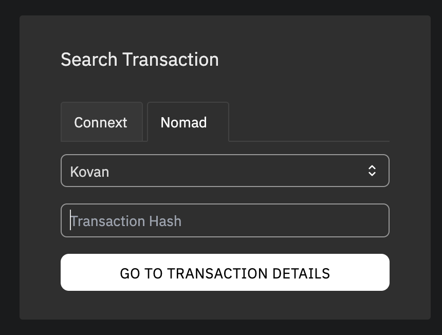

 

Once your transfer has completed, you should see the below display and your funds will be in the account of your destination address.

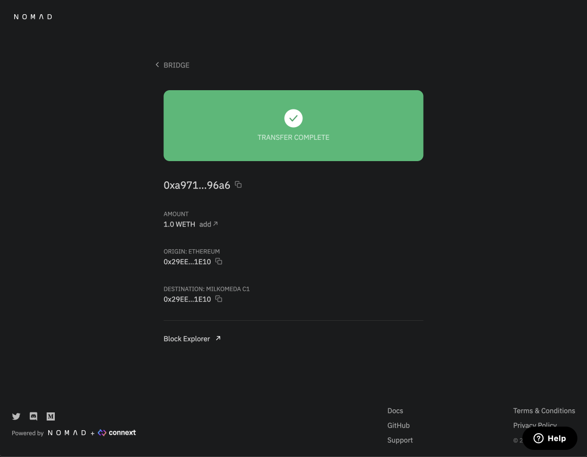

 

You may need to import the token address into your wallet in order to see your funds. The addresses of Nomad assets on Milkomeda can be found [here](https://docs.nomad.xyz/bridge/domains.html#milkomeda-c1).

If need help with your transfer or have any questions, please reach out to the Nomad team on [Discord](https://discord.gg/RurtmJApqm) in the #support channel.

## Fast Bridging with Connext

Need your funds ASAP? Read more about fast bridging using Connext [here](https://docs.nomad.xyz/bridge/nomad-gui.html).
